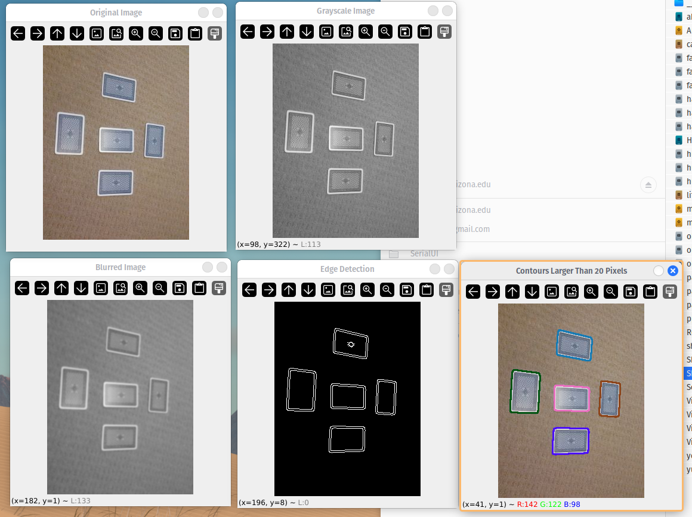
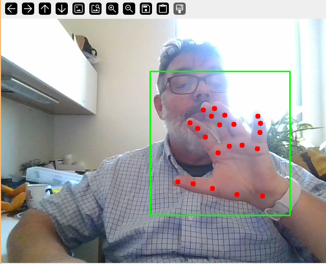

# Prompt Engineering
We will create computer code with AI agent. For the solutions I used [ChatGPT](https://chatgpt.com/). But other agents such as [DeepSeek](https://www.deepseek.com/) or [Claude](https://claude.ai/) will work too.

***This is new self paced homework. I do not know how difficult it will be for you. Feedback is welcome.***

- [Prompt Engineering](#prompt-engineering)
  * [Image and Video Processing](#image-and-video-processing)
    + [Load and Manipulate Images](#load-and-manipulate-images)
    + [Count Objects](#count-objects)
    + [Object Detection](#object-detection)
  * [Audio Processing](#audio-processing)
  * [Reading and Processing Data](#reading-and-processing-data)
    + [Ask AI agent to Analyze Data](#ask-ai-agent-to-analyze-data)
    + [Load and Analyze Data Files](#load-and-analyze-data-files)

<small><i><a href='http://ecotrust-canada.github.io/markdown-toc/'>Table of contents generated with markdown-toc</a></i></small>

Created by Urs Utzinger January 2025 with inspiration from [Python for Engineers](https://new.pythonforengineers.com)

Solutions are included but the goal is to create them by yourself.

## Image and Video Processing
### Load and Manipulate Images

1) Ask your AI agent to load the image.jpg and display it using **opencv**.

For example:
```In python using opencv, load the image ship.jpg and display it```

Answer:
```
import cv2

# Load the image
image = cv2.imread('ship.jpg')

# Check if the image was loaded successfully
if image is None:
    print("Error: Could not load image. Please make sure the file path is correct.")
else:
    # Display the image
    cv2.imshow('Ship Image', image)

    # Wait for a key press and close the image window
    cv2.waitKey(0)
    cv2.destroyAllWindows()
```

2) Ask your AI agent to convert the image to gray scale after loading it and to display both the original and gray scale image.

3) Ask your AI agent to blur the grayscale image and display it.

 <a href="./Ship_Images.png" target="_blank">  </a> 


4) Ask your AI agent to apply an edge detection algorithm to the blurred image and display it.

5) Ask your AI agent to rotate the image 90 degrees, 180 degrees and 30 degrees and display them.

6) Ask your AI agent what an affine transformation is what different types of transformations there are besides rotation.

<a href="./Ship_Images_Rotated.png" target="_blank">  </a>

### Count Objects

1) Ask your AI agent to load the cards.jpg image and display it.

2) Now ask it to blur it and then perform edge detection with the purpose to find contours in the edges. Ask it to display each contour on top of the original image.

3) Ask your agent how contour detection works.

4) Ask it to modify the program so that it lets you know how many contours it found that enclose more than 50 pixels and then outline each found object with different color.

5) Ask it if there are other methods one could use to separate the contours, for example based on shape.

<a href="./Example_Cards.png" target="_blank">  </a>

### Object Detection

1) Ask your AI agent to create a python program that opens the camera, obtains an image and displays it. Specify that you want to obtain each image separately before displaying it.

2) Ask your AI agent to continuously grab an image and put them into a *first in - first out* buffer (FIFO). In a separate thread you will want to grab an image from the buffer and display it. Ask that it creates a frames per second measurement and displays the number to the bottom left of the image.

Mine looks like that:

```python
import cv2
import threading
from queue import Queue
import time

# Queue for thread-safe frame sharing
frame_queue = Queue(maxsize=10)
running = True
fps = 0

def capture_images():
    """Capture images in a thread-safe way and put them in a queue."""
    global running
    cap = cv2.VideoCapture(0)  # Default camera index
    if not cap.isOpened():
        print("Error: Could not access the camera.")
        running = False
        return

    while running:
        ret, frame = cap.read()
        if ret:
            if frame_queue.full():
                frame_queue.get()  # Remove oldest frame to make space
            frame_queue.put(frame)  # Add the new frame to the queue
        time.sleep(0.03)  # Simulate ~30 FPS capture rate

    cap.release()

def display_images():
    """Retrieve images from the queue and display them with FPS."""
    global running, fps
    frame_count = 0
    start_time = time.time()

    while running:
        if not frame_queue.empty():
            # Calculate FPS
            frame_count += 1
            elapsed_time = time.time() - start_time
            if elapsed_time > 1.0:  # Update FPS every second
                fps = frame_count
                frame_count = 0
                start_time = time.time()

            # Get the frame and draw the FPS
            frame = frame_queue.get()
            cv2.putText(frame, f"FPS: {fps}", (10, frame.shape[0] - 10),
                        cv2.FONT_HERSHEY_SIMPLEX, 0.6, (0, 255, 0), 2)

            # Display the frame
            cv2.imshow("Camera Output", frame)

        # Exit on 'q' key press
        if cv2.waitKey(1) & 0xFF == ord('q'):
            running = False
            break

    cv2.destroyAllWindows()

# Create and start threads
capture_thread = threading.Thread(target=capture_images, daemon=True)
capture_thread.start()

try:
    display_images()
except KeyboardInterrupt:
    print("Exiting...")
    running = False

capture_thread.join()

```

The advantage of this code is that you run two programs and don't need to wait until one program is finished. If you were to run this sequentially you would not wasting the time when the image is transferring to your computer. This way images arrive continuously and the display is also continuously.

<a href="./Camera_ok.png" target="_blank">  </a>


3) Ask it to help you obtain neural network models from https://github.com/opencv/opencv_zoo.  You want a copy of the zoo on your computer. Its called a zoo because it has several "animals" in the package.

**Now decode which of the following 3 examples you want to do**:

4) Ask it to use the previous program to capture video and to include code to load the face detection model and apply it to each frame and then draw the bounding box and land marks on the image. You will need to find the appropriate model or ask the AI agent to search the answer on the model zoo website. Not all AI agents can search a website. Since these models are fairly new the AI agent likely does not know exactly how to use them. Once you know the model, you can find the example code from the website. You can either upload the example code or paste it together with your question into the AI agent. I asked it to look at the code and include it to provide the solution. Your solution does not need to look like mine.

<a href="./Camera_Face.png" target="_blank">  </a>

You can see that it found my pupils, nose and edge of mouth and its 90% confident that its a face.

5) Ask the AI agent what a good model would be for hand and finger detection from the model zoo. Then find it in the downloaded opencv_zoo. If your AI agent can not read the web you need to check the readme file for the zoo. Ask it to use the previous program to capture video and to include code to load the hand detection model.

<a href="./Hands.png" target="_blank">  </a>

This is very interesting as it now shows all the hand and finger segments. You could decode it for sign language or do some simple gesture analysis but we dont do that now.

7) In some of the lecture notes the instructor shows YOLO on a James Bond movie. The opencv zoo has YOLOX. Ask that your program recognizes simple objects such as the ones in a YOLO algorithm. You likely will need to give the AI agent the example code. You can just include it with your question. I have the example programs in in `opencv_zoo/models/object_detection_yolox`.

<a href="./Example_Yolox.png" target="_blank">  </a>

Its working quite well but is slow. It takes my wallet as a phone. I bet if opencv would use the cuda extension (NVIDEA graphics cards) it would be faster. But for that, you need to build/compile opencv and it will take quite some time. So lets not do that.

## Audio Processing

1) Ask your AI agent to create a sin wave at 1000Hz, display it in a graph with matplotlib and play it over the speakers of your computer. It's possible you need to tell it what computer you are using so that it can use the appropriate library for audio playback.

<a href="./Example_Sinewave.png" target="_blank">  </a>

2) Ask it to plot the power spectrum of your signal and to use logarithmic scale on the y axis so it displays deciBel. I sometimes need to look up the definition for dB. If you don't know it perhaps you want to ask what its used for.

<a href="./Example_Power.png" target="_blank">  </a>

I like these plots and they look very similar to what Matlab does when you plot graphs.

3) Often we have noise from the power lines in signals such as the electro cardio gram. That noise is at 60Hz. You can ask your AI agent to add a noise sine wave at 60Hz and make its amplitude 1/3 of the main frequency.

<a href="./time_domain_plot.png" target="_blank">  </a>

<a href="./power_spectrum.png" target="_blank">  </a>

This looks as expected.

4) Now we want to create a filer on the audio signal that suppresses the signal at 60Hz but leaves the other signal intact. Often this is called a notch filter at 60Hz. You will need it in BME417 if you take that class.

<a href="./time_domain_plot_filter.png" target="_blank">  </a>
<a href="./power_spectrum_filter.png" target="_blank">  </a>


**This is optional part and will give you extra credit**

5) Lets try this in realtime. That can be difficult with python because Python is not a high performance programming language. ChatGPT suggests that I use pyqtgraph to display the signal and the spectrum. I told it that I want to record the audio in realtime, filter it and display the signal as well as the filtered power spectrum. Since I use pyqtgraph it likely will also want to use *Qt* which can be used to create a user interface. You AI agent can tell you how to install it. 

I changed the notch frequency to 2000Hz and I whistled. I can observe that the power spectrum is reduced when I hit that frequency. You can create the tone with an other python program which you can run simultaneously. Visual Studio Code will ask you if you really want to run two programs:

```python
import numpy as np
import sounddevice as sd

fs = 44100  # Sampling rate (Hz)
duration = 2.0  # seconds
frequency = 1000  # Hz (tone frequency)

t = np.linspace(0, duration, int(fs * duration), endpoint=False)
tone = 0.5 * np.sin(2 * np.pi * frequency * t)  # Generate sine wave

sd.play(tone, samplerate=fs)
sd.wait()
```

<a href="./Audio_realtime_1000.png" target="_blank">  </a>

<a href="./Audio_realtime_2000.png" target="_blank">  </a>

If these signals look strange to you, BME330 will talk about it again. Also any Engineering Analysis match course might discuss it. There are also classes in ECE on signal processing. Its really astonishing how simple it is these days to ask for demo programs or explanation how something works.

## Reading and Processing Data

**We have two sections. One where we send data to a server to process it and one where we obtain a file and plot some of the data. You can do both or choose one.**

### Ask AI agent to Analyze Data

1) We want ChatGPT to read my emails and summarize them. I tested this on my personal gmail account. It does not work with coperate email such as Catmail nor Office365 as my employer blocks App passwords. Since I have two factor authentication enabled, I had to create an application password instead of using my regular google password. For gmail I went to https://myaccount.google.com/security and clicked on 2-step verification created an app password at the bottom. This worked better when I googled how to do it. I also created an account at openai platform and put a small amount of money into my account https://platform.openai.com/signup/ then I created an OpenAI API Key (Application Interface). This allows you to use OpenAI from a program over the internet without posting in a web browser. 

You should ask your AI agent that you want to read your email in batches of 50 emails but only from the last 2 days and extract the text and have it summarized by OpeanAI. The AI agent tried to be smart and only read some subsections of the emails which did not work, so you should ask it to simply read the email using (RFC822).

The code this creates is a few months behind and will not work right away. OpenAI changed slightly how to use its API. Also it has now different models: I would use the model "gpt-4o-mini" as that was the least expensive. If the errors the program makes you can post back to the AI agent and it might be able to fix it. Otherwise you can check on Google. After summarizing a few emails I still only have used 1 cents in my account.

You can imagine that with text to speech you could also have your program read the email or summary to you. But we dont do that here.

<a href="./ChatGPT_email_reader.png" target="_blank">  </a>

### Load and Analyze Data Files

We are going to use the Pima Indians Diabetes Database to analyze health data. Download the dataset from [Kaggle](https://www.kaggle.com/datasets/uciml/pima-indians-diabetes-database) Its a comma separated vlues text file (CSV). But using pandas you can obtain it directly from internet.

2) Ask your AI agent to obtain the dataset from Github and plot histogram. You can see that some histograms have quite a few values at 0. These are missing data points and should be excluded from the plots. In my first attempt ChatGPT replaced them with Median and I told it not to do that and just replace the Zeroes with NaNs (Not a Number) and repeat the plots.

<a href="./DataSummary.png" target="_blank">  </a>

<a href="./Cleanup.png" target="_blank">  </a>

3) Now we would like to see if there are difference between outcomes (having diabetes versus not having diabetes). You can ask to make a bar graph with the mean values for the two outcome groups. You can see that some values seem to be larger in the outcome group. In other classes you will learn how to enhance such plot with error bars or whiskers to better illustrate if the separation is significant.

<a href="./MeanComparison.png" target="_blank">  </a>

4) And finally we would like to compute the correlations. My AI agent asked me to install seaborn for that. And it created a heatmap showing correlations. Strong correlation is between 0.7 and 0.9, moderate 0.4 and 0.7 and weak between 0.2 and 0.4. There are other courses where calculation of correlation coefficient is explained.


<a href="./Correlation.png" target="_blank">  </a>

ChatGPT says that

| Feature 1	| Feature 2	| Interpretation
| ----------|-----------| --------------
| Glucose	| Outcome	| Strong positive correlation (Diabetic patients tend to have higher glucose levels)
| BMI	    | Outcome	| Moderate positive correlation (Higher BMI increases diabetes risk)
| Age	    | Outcome	| Weak to moderate correlation (Older individuals are at higher risk)
| Glucose	| BMI	    | Weak to moderate correlation (Obesity can affect blood sugar levels)
| BloodPressure	| Glucose | 	Weak correlation (Blood pressure and glucose are related but not strongly)

But numbers don't quite match.